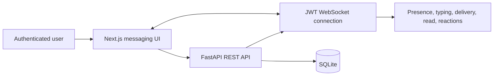

# Signal Clone — Real-Time Messaging Platform

Signal Clone is a full-stack messaging application built for the Scaler SDE
Fullstack assignment. It supports private and group conversations, message
requests, live delivery/read state, reactions, attachments, replies, forwarding,
disappearing messages, and responsive Signal-inspired UI.


[Live demo](https://signal-clone-smoky.vercel.app) · [Backend health](https://signal-clone-backend-hoah.onrender.com/health) · [Repository](https://github.com/Sriman-Kunda-056/Signal_clone)

## Evidence at a glance

| Capability | Included |
| --- | :---: |
| Real-time WebSocket events | Yes |
| Authentication flow | Phone + mocked OTP + JWT |
| Direct and group chat | Yes |
| Message actions | Reply, forward, pin, delete, copy, select |
| Attachments and avatars | Base64-backed image/file uploads |
| Deployment | Vercel frontend + Render backend |

## Preview



## What it does

The application keeps REST as the persistent source of truth and uses a
JWT-authenticated WebSocket connection for live message, typing, presence,
reaction, and receipt updates.


## Tech stack

| Layer | Choice |
|---|---|
| Frontend | Next.js 16 (App Router, TypeScript), Tailwind CSS v4, Zustand |
| Backend | FastAPI (Python), SQLAlchemy |
| Database | SQLite |
| Real-time | Native WebSockets (one connection per client, JWT-authenticated) |
| Auth | JWT bearer tokens (not cookies — see [Architecture](#architecture)) |
| Deployment | Vercel (frontend) + Render (backend, Docker) |

## Features

- **Auth** — Signal's real registration order: phone number → mocked OTP (`123456`) → username/display name/password. Login/logout, session persisted client-side via JWT.
- **Contacts & conversation list** — search, unread badges, last-message preview, online/last-seen, sorted by recent activity, per-user Archive shelf.
- **1:1 messaging** — real-time delivery, typing indicators, delivery/read receipts (circular ticks, outline → filled on read), all persisted.
- **Message requests** — starting a chat with someone you don't already have an accepted relationship with opens as a request on their side (Accept/Block/Delete), matching Signal's real behavior — including the quirk where two people messaging each other independently before either accepts get two separate threads that merge into one once somebody accepts. See [Assumptions](#assumptions--design-notes).
- **Group messaging** — create groups, add/remove members (admin-only), member list, persisted history.
- **Attachments** — images (auto-compressed client-side) and arbitrary files, stored inline as base64. See [Assumptions](#assumptions--design-notes) for why.
- **Emoji reactions** — one reaction per person per message, live over WebSocket.
- **Signal-accurate UI** — left icon rail (Chats/Calls/Stories, collapsible, with a bottom tab bar on mobile), Signal's actual color tokens, timestamp-in-bubble layout, dark/light theme, responsive across mobile/tablet/desktop.
- **Placeholders** — voice/video calls, Stories, linked devices are "Coming soon" rather than silently missing.
- **Screen privacy** — a real, toggleable, best-effort reaction to PrintScreen/window-blur (see [Assumptions](#assumptions--design-notes) for the honest limits of what a website can actually do here).

- **Message actions** — reply with quoted previews, forward to another conversation, pin/unpin, copy, delete your own messages, and multi-select for bulk forwarding.
- **Disappearing messages** — a per-conversation timer applies to newly sent messages; expired messages are filtered server-side.
- **Profile avatars** — choose and upload a profile photo from Settings; it is compressed and persisted with the account.
- **Optimistic sending** — outgoing messages render immediately with a Sending/Failed state while the API confirms delivery.

## Architecture

```
frontend/  Next.js client — REST for CRUD, one WebSocket for everything live
backend/   FastAPI — routers/ (REST), ws.py (the WebSocket endpoint + connection manager)
```

- **Auth is JWT-in-header, not cookies.** The frontend and backend are deployed on different domains (Vercel + Render), which rules out cookie sessions (third-party cookie blocking, SameSite). The frontend stores the token client-side and sends `Authorization: Bearer <token>`.
- **REST is the source of truth; WebSocket is the delivery mechanism.** Sending a message is a `POST`, which persists to the DB first and then pushes a `new_message` event over the socket to whoever's online. Typing indicators and presence are WebSocket-only and never persisted.
- **One `/ws` connection per client**, authenticated via a `token` query param (the browser WebSocket API can't set custom headers on the handshake). A user can have multiple sockets open (multiple tabs) — the connection manager fans events out to all of them and only marks a user offline once every socket has closed.

## Database schema

- **users** — `id, username, phone_number, display_name, avatar_url, password_hash, is_online, last_seen_at, created_at`
- **contacts** — `id, owner_id → users, contact_id → users, created_at`. Self-referential; only ever created server-side when a direct conversation becomes mutually accepted (never by directly "adding" someone).
- **conversations** — `id, type (direct|group), name, avatar_url, created_by, created_at`
- **conversation_participants** — `id, conversation_id, user_id, role (admin|member), request_status (accepted|pending|blocked), joined_at, last_read_at, left_at, is_archived`. The join table between users and conversations; `request_status` drives the message-request UI, `left_at` is a soft-delete marker, `is_archived` is an independent per-user shelf (see [Assumptions](#assumptions--design-notes)).
- **messages** — `id, conversation_id, sender_id, content, message_type (text|image|file), reply_to_message_id, created_at`. For `image`/`file`, `content` is a base64 data URL rather than plain text.
- **message_status** — `id, message_id, user_id, status (sent|delivered|read), updated_at`. One row per (message, recipient) pair, so read receipts work correctly in groups.
- **message_reactions** — `id, message_id → messages, user_id → users, emoji, created_at`, unique on `(message_id, user_id)` — one reaction per person per message; reacting again replaces it.

Relationships: `users` 1—N `contacts` (self-referential), `users` N—N `conversations` via `conversation_participants`, `conversations` 1—N `messages`, `messages` 1—N `message_status`, `messages` 1—N `message_reactions`.

## API overview

All routes except `/auth/register` and `/auth/login` require `Authorization: Bearer <token>`.

**Auth** — `POST /auth/register`, `POST /auth/login`, `GET /auth/me`

**Contacts** — `GET /contacts`, `GET /contacts/search?q=`

**Conversations**
- `GET /conversations?archived=false` — list, sorted by last activity
- `POST /conversations` — create/open a direct or group conversation
- `GET /conversations/{id}`
- `POST /conversations/{id}/respond` — `{action: accept|block|delete}` on a message request
- `POST /conversations/{id}/archive` — `{archived: bool}`
- `POST /conversations/{id}/members`, `DELETE /conversations/{id}/members/{member_id}` — group admin only
- `POST /conversations/{id}/read` — mark read, triggers read-receipt push

**Messages**
- `GET /conversations/{id}/messages`, `POST /conversations/{id}/messages` (`message_type: text|image|file`)
- `POST /conversations/{id}/messages/{message_id}/reactions` — `{emoji}`, upserts (replaces) the caller's own reaction
- `DELETE /conversations/{id}/messages/{message_id}/reactions` — removes the caller's own reaction

**WebSocket** — `GET /ws?token=<jwt>` — events: `new_message`, `typing`, `presence`, `message_status`, `conversation_updated`, `message_reaction`

## Setup

**Backend**

```bash
cd backend
python -m venv .venv
.venv/Scripts/activate   # .venv/bin/activate on macOS/Linux
pip install -r requirements.txt
cp .env.example .env     # adjust JWT_SECRET, CORS_ORIGINS
uvicorn app.main:app --reload --port 8000
```

The SQLite DB auto-creates and seeds demo data (six users, existing conversations, a group) on first run if empty.

**Frontend**

```bash
cd frontend
npm install
cp .env.example .env.local   # NEXT_PUBLIC_API_URL / NEXT_PUBLIC_WS_URL
npm run dev
```

Visit `http://localhost:3000`.

**Demo accounts** (seeded, password `password123` for all): `rajini`, `kamal`, `prabhas`, `vijay`, `dhanush`, `allu`.

## Assumptions & design notes

- **Message requests fully implemented, including the duplicate-thread edge case.** A brand-new direct chat is never silently merged into an existing unaccepted one — so if two people message each other independently before either accepts, they get two separate threads, which fold into one (messages merged in chronological order, mutual contact created) the moment either side accepts.
- **Soft delete, not hard delete.** Deleting a message request, removing a group member, or archiving all use non-destructive markers (`left_at`, `is_archived`) rather than deleting rows — a hard delete would erase that person's name/avatar from the remaining participant's copy of the conversation (their identity was only ever resolved through that row). Message sender identity is resolved from the message's own `sender` field, independent of current group membership, for the same reason.
- **Attachments are stored as base64 inside SQLite, not on disk.** The deploy target's disk is ephemeral (wiped on redeploy), so a conventional file upload would just vanish; storing the (compressed, size-capped) data inline means an attachment persists exactly as reliably as every other message, at the cost of DB size — a deliberate tradeoff over adding a third-party storage account (S3/Cloudinary) for a demo app.
- **Reactions replace, not stack.** One reaction per person per message — reacting again (even with a different emoji) replaces your previous one, matching Signal's real behavior, enforced by a unique constraint rather than app-level bookkeeping.
- **Screen privacy is real but explicitly best-effort, not a guarantee.** A website has no API to see or block PrintScreen/Snipping Tool/OS screen recording, and no API to minimize its own window — those are OS/native-app-only capabilities. What's implemented instead: the app reacts to the PrintScreen keydown (a real DOM event on Windows) and to the window losing focus/visibility by throwing up a covering overlay. This reduces exposure; it does not guarantee the OS's own screenshot is empty, since a page can't reliably race that timing. Toggleable in Settings → Privacy, defaulting on to match Signal's own default.
- **Group conversations don't have request/accept semantics** — only direct chats do, matching the assignment's core requirements. Group join-requests are a separate, more complex system in real Signal and out of scope here.
- **Real end-to-end encryption is mocked**, as explicitly permitted by the assignment — the UI shows a notice that encryption is simulated.
- **Contacts are derived, not manually managed.** There's no standalone "add contact" action; contacts are created automatically once a direct conversation becomes mutually accepted, which is also what populates the "New Group" member picker.
- **Chat folders are a placeholder.** A full custom-folder taxonomy (beyond the built-in Archive) was judged low-value relative to its effort for this assignment's scope.

## Deployment

- **Frontend:** Vercel, auto-deploys from this repo's `frontend/` directory.
- **Backend:** Render (Docker web service, free tier — see `render.yaml`), `backend/Dockerfile`. Free-tier caveats: the instance sleeps after 15 minutes idle (first request after that takes 30-50s to wake), and there's no persistent disk, so the SQLite file resets to the seeded demo data on every redeploy — the backend's startup event auto-reseeds if the `users` table is empty, so this is a graceful reset rather than a broken app.
- CORS on the backend allow-lists only the deployed frontend origin exactly (no trailing slash/path — an `Origin` header is always just `scheme://host[:port]`); `allow_credentials=False` since auth is header-based, not cookie-based.
